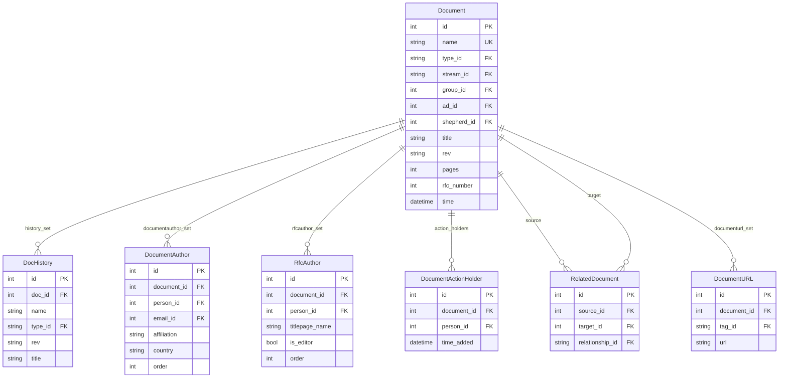
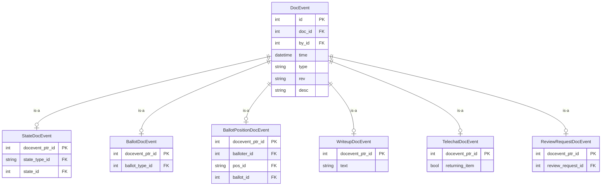

# Document

The `doc` app holds metadata about all document artifacts managed by the datatracker.
The actual document content (text, PDF, XML) lives on the filesystem or in blob storage;
the database holds only the metadata and the history of changes to it.

## Document types

The `type` field of a `Document` is a FK to `DocTypeName`. Current types include:

| slug | Description |
|------|-------------|
| `draft` | Internet-Draft |
| `rfc` | RFC (a distinct record, not just a state of a draft) |
| `charter` | Working Group charter |
| `conflrev` | Conflict review |
| `statchg` | RFC status change |
| `bofreq` | BOF request |
| `statement` | IETF statement |
| `liaison` | Liaison statement |
| `liai-att` | Attachment to a liaison statement |
| `review` | Review document |
| `shepwrit` | Shepherd's writeup |
| `agenda` | Meeting agenda |
| `minutes` | Meeting minutes |
| `narrativeminutes` | Narrative minutes |
| `bluesheets` | Meeting bluesheets |
| `slides` | Meeting slides |
| `recording` | Meeting recording |
| `procmaterials` | Secretariat-provided proceedings material |
| `chatlog` | Meeting chat log |
| `polls` | Meeting polls |

## Document identification

`Document.name` is a unique, immutable string used as the primary human-readable key.
It appears in URLs, in inter-model FKs, and is the basis for filenames on disk.

> **Note:** A `DocAlias` indirection layer existed in older versions of the codebase but
> has been removed. Documents are now referenced directly by their `name` field throughout
> all codepaths.

### RFCs vs Internet-Drafts

RFCs are now stored as separate `Document` records with `type_id="rfc"` and a numeric
`rfc_number` field. When an Internet-Draft is published as an RFC, a `RelatedDocument`
record with `relationship="became_rfc"` is created linking the draft to the RFC. The draft
is not deleted; both records persist.

```python
from ietf.doc.models import Document

# Get an RFC by number
rfc = Document.objects.get(type='rfc', rfc_number=9110)

# Get the draft that became this RFC
draft = rfc.related_that('became_rfc')[0]  # the source of a became_rfc relationship

# Alternatively, from a draft:
draft = Document.objects.get(name='draft-ietf-httpbis-semantics')
rfc = draft.became_rfc()  # returns the RFC Document or None
```

## Core document model

`DocumentInfo` is an abstract base class shared by `Document` (the live record) and
`DocHistory` (point-in-time snapshots). Key fields:

| Field | Description |
|-------|-------------|
| `type` | FK → DocTypeName |
| `title` | Human-readable title |
| `abstract` | Document abstract |
| `rev` | Current revision (e.g. `03`) |
| `pages` / `words` | Document statistics |
| `stream` | FK → StreamName (ietf, iab, irtf, ise, editorial) |
| `group` | FK → Group (sponsoring WG, area, etc.) |
| `ad` | FK → Person (responsible Area Director) |
| `shepherd` | FK → Email (document shepherd) |
| `std_level` | FK → StdLevelName (PS, DS, STD, BCP, …) |
| `intended_std_level` | FK → IntendedStdLevelName |
| `formal_languages` | M2M → FormalLanguageName (ABNF, YANG, JSON, …) |
| `states` | M2M → State (multiple simultaneous states across state machines) |
| `tags` | M2M → DocTagName |
| `rfc_number` | Numeric RFC number; only set when `type="rfc"` |
| `keywords` | JSON array of keywords |



## Authors

`DocumentAuthor` records link a `Document` to one or more `Person` records, capturing
affiliation and country at the time of each revision. For RFCs, a parallel `RfcAuthor`
model stores names exactly as they appear on the RFC title page, which may differ from the
person's current `Person.name` (or may not be resolvable to any `Person` at all, for
legacy RFCs).

## Document history

When a document is revised or its metadata changes, the current state of the `Document`
object is snapshotted into a `DocHistory` record before the change is applied. Related
records (`DocumentAuthor`, `RelatedDocument`) are snapshotted in parallel as
`DocHistoryAuthor` and `RelatedDocHistory`.

## States

Documents can simultaneously hold multiple states, one per *state type*. State types
correspond roughly to the processing pipeline each document passes through:

```python
from ietf.doc.models import State

for state in State.objects.filter(type='charter'):
    print(f'{state.slug}: {state.name}')
# notrev: Not currently under review
# infrev: Draft Charter (Informal Review)
# intrev: Start Chartering/Rechartering (Internal Review)
# extrev: External Review
# iesgrev: IESG Review
# approved: Approved
# replaced: Replaced
```

Internet-Drafts (`type="draft"`) are the most complex, participating in several
independent state machines simultaneously:

| State type | Description |
|-----------|-------------|
| `draft` | Basic lifecycle (active, expired, replaced, etc.) |
| `draft-iesg` | IESG processing (AD Evaluation → IESG Evaluation → RFC Queue, etc.) |
| `draft-iana` | IANA review |
| `draft-rfceditor` | RFC Editor queue state |
| `draft-stream-ietf` | IETF stream state |
| `draft-stream-irtf` | IRTF stream state |
| `draft-stream-ise` | ISE stream state |
| `draft-stream-iab` | IAB stream state |
| `draft-iana-action` | IANA action state |
| `draft-iana-review` | IANA review state |

```python
from ietf.doc.models import Document

doc = Document.objects.get(name='draft-ietf-httpbis-http2bis')
doc.states.all()
# <QuerySet [<State: Active>, <State: AD Evaluation>,
#            <State: Submitted to IESG for Publication>]>
```

State transitions are modelled in `State.next_states` (a M2M to itself). Groups can also
define custom overrides for the allowed transitions via `GroupStateTransitions`.


## Document relationships

`RelatedDocument` captures directed relationships between documents. The `relationship`
field is a FK to `DocRelationshipName`:

| slug | Meaning |
|------|---------|
| `replaces` | Source replaces target |
| `updates` | Source updates target |
| `obs` | Source obsoletes target |
| `became_rfc` | Source (draft) became target (RFC) |
| `refnorm` | Normative reference |
| `refinfo` | Informative reference |
| `conflrev` | Conflict review |
| `tops` / `toinf` / `tobcp` / … | Standards track movement |

```python
from ietf.doc.models import RelatedDocument

# How many normative references to BCP 14 / RFC 2119?
RelatedDocument.objects.filter(
    relationship='refnorm',
    target__name__in=('draft-bradner-key-words', 'rfc2119', 'bcp14')
).count()
```

## DocEvent — the audit trail

As things happen to a document (new revision uploaded, state changed, ballot position
recorded, last call sent, etc.) a `DocEvent` record is appended. These events are what
appear in the History tab when looking at a document in the datatracker.

`DocEvent` records are **never deleted**. All ballot positions for a given AD on a given
document are retained; the current position is the record with the most recent timestamp.

`DocEvent` has many specialised subclasses (Django multi-table inheritance):

| Subclass | Purpose |
|----------|---------|
| `NewRevisionDocEvent` | New revision submitted |
| `StateDocEvent` | State change (holds old + new state) |
| `BallotDocEvent` | Ballot created or closed |
| `IRSGBallotDocEvent` | IRSG ballot events |
| `BallotPositionDocEvent` | Individual ballot position from one person |
| `WriteupDocEvent` | Writeup text change |
| `LastCallDocEvent` | Last call sent, including expiry date |
| `TelechatDocEvent` | Added to or removed from telechat agenda |
| `ReviewRequestDocEvent` | Review requested |
| `ReviewAssignmentDocEvent` | Review assigned |
| `InitialReviewDocEvent` | Initial review events |
| `ConsensusDocEvent` | Consensus changed |
| `AddedMessageEvent` | Message attached to document |
| `SubmissionDocEvent` | Submission-related event |
| `EditedAuthorsDocEvent` | Author list changed |
| `EditedRfcAuthorsDocEvent` | RFC title-page author list changed |
| `BofreqEditorDocEvent` | BOF request editor changed |
| `BofreqResponsibleDocEvent` | BOF request responsible AD changed |
| `IanaExpertDocEvent` | IANA expert review comment |



Because the current value of many document attributes is determined by scanning events
(e.g. "the current ballot position for AD X is the most recent `BallotPositionDocEvent`
for that AD on this document"), some queries can be expensive. Be aware of this when
writing analytics queries.

```python
from django.db.models import Count
from ietf.doc.models import Document

# Documents with the most individual ballot position events
Document.objects.annotate(
    poscount=Count('docevent__ballotpositiondocevent')
).order_by('-poscount')[:5].values_list('name', 'poscount')
```

Charters tend to rank highly in such queries because each revision of a charter is
balloted separately, while drafts typically go through the full ballot process only once.

## BallotType

`BallotType` defines the kinds of ballot available for a given document type (e.g. IESG
approval ballot, IRSG ballot). It holds the list of valid positions via a M2M to
`BallotPositionName`, some of which are marked `blocking`.
