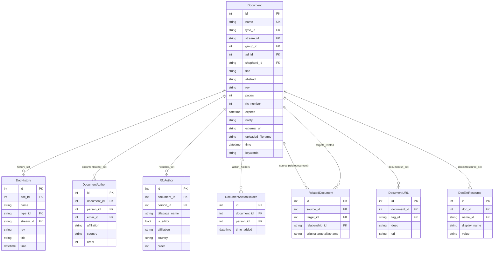
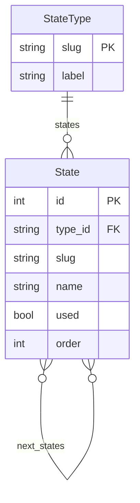
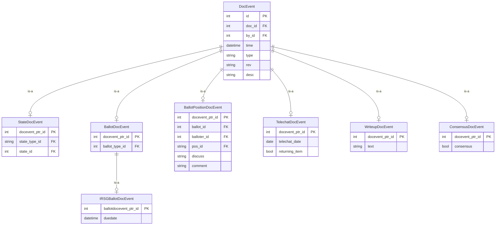

# Document

The `doc` app holds metadata about all document artifacts managed by the datatracker.
The actual document content (text, PDF, XML) lives on the filesystem or in blob storage;
the database holds only the metadata and the history of changes to it.

## Document types

The `type` field of a `Document` is a FK to `DocTypeName`. Current types include:

| slug | Description |
|------|-------------|
| `draft` | Internet-Draft |
| `rfc` | RFC (a distinct record, not just a state of a draft) |
| `bcp` | BCP subseries entry |
| `std` | STD subseries entry |
| `fyi` | FYI subseries entry |
| `charter` | Working Group charter |
| `conflrev` | Conflict review |
| `statchg` | RFC status change |
| `bofreq` | BOF request |
| `statement` | IETF statement |
| `liaison` | Liaison statement |
| `liai-att` | Attachment to a liaison statement |
| `review` | Review document |
| `shepwrit` | Shepherd's writeup |
| `agenda` | Meeting agenda |
| `minutes` | Meeting minutes |
| `narrativeminutes` | Narrative minutes |
| `bluesheets` | Meeting bluesheets |
| `slides` | Meeting slides |
| `recording` | Meeting recording |
| `procmaterials` | Secretariat-provided proceedings material |
| `chatlog` | Meeting chat log |
| `polls` | Meeting polls |

The `bcp`, `std`, and `fyi` types are subseries. A subseries document does not have its
own content; it is a container that groups RFCs via `RelatedDocument` records with
`relationship="contains"`. `Document.objects.subseries_docs()` returns a queryset
filtered to these three types.

## Document identification

`Document.name` is a unique, immutable string that serves as the primary human-readable
key. It appears in URLs, in inter-model FKs, and is the basis for filenames on disk.
The field is validated to contain only lowercase letters, numbers, and hyphens
(`validate_docname`).

> **Note:** A `DocAlias` indirection layer existed in older versions of the codebase but
> has been removed. Documents are now referenced directly by their `name` field throughout
> all codepaths.

### RFCs vs Internet-Drafts

RFCs are stored as separate `Document` records with `type_id="rfc"` and a numeric
`rfc_number` field. When an Internet-Draft is published as an RFC, a `RelatedDocument`
record with `relationship="became_rfc"` is created linking the draft to the RFC. The draft
is not deleted; both records persist. Neither record's `name` changes.

```python
from ietf.doc.models import Document

# Get an RFC by number
rfc = Document.objects.get(type='rfc', rfc_number=9110)

# Get the draft that became this RFC
draft = rfc.came_from_draft()   # returns the source Document or None

# From a draft, find the RFC it became (if any)
draft = Document.objects.get(name='draft-ietf-httpbis-semantics')
rfc = draft.became_rfc()        # returns the RFC Document or None
```

`rfc.doi` returns the DOI string (e.g. `"10.17487/RFC9110"`) for RFCs with a numeric
`rfc_number`; `None` otherwise.

`pub_date()` and `pub_datetime()` return the publication date. For RFCs this comes from
the `published_rfc` `DocEvent`; for other documents from the `new_revision` event. RFC
publication datetimes are stored in the `PST8PDT` timezone to match the timezone used by
the RFC Editor when assigning official publication dates.

## DocumentInfo — the abstract base

`DocumentInfo` is an abstract base class shared by `Document` (the live record) and
`DocHistory` (point-in-time snapshots). All fields listed here exist on both.

| Field | Description |
|-------|-------------|
| `type` | FK → DocTypeName |
| `title` | Human-readable title |
| `abstract` | Document abstract |
| `rev` | Current revision string (e.g. `"03"`; `""` for RFCs) |
| `pages` / `words` | Page and word counts |
| `stream` | FK → StreamName (`ietf`, `iab`, `irtf`, `ise`, `editorial`) |
| `group` | FK → Group (sponsoring WG, area, etc.) |
| `ad` | FK → Person (responsible Area Director) |
| `shepherd` | FK → Email (document shepherd) |
| `std_level` | FK → StdLevelName — actual standards level (PS, DS, STD, BCP, …) |
| `intended_std_level` | FK → IntendedStdLevelName — level sought by the authors |
| `formal_languages` | M2M → FormalLanguageName (ABNF, YANG, JSON, …) |
| `states` | M2M → State — multiple simultaneous states across state machines |
| `tags` | M2M → DocTagName |
| `rfc_number` | Numeric RFC number; only meaningful when `type="rfc"` |
| `keywords` | JSON array of keywords |
| `expires` | Expiry datetime for Internet-Drafts |
| `notify` | Comma-separated email addresses to notify on state changes |
| `external_url` | URL to document content hosted externally (e.g. recordings) |
| `uploaded_filename` | Filename of an uploaded file; overrides the default naming scheme |
| `note` | Free-text note from the secretariat or AD |

## Saving documents

**`Document.save()` is protected.** Calling it directly will raise an `AssertionError`
unless you are inserting a brand-new record. Any update to an existing `Document` must
go through `save_with_history(events)`, which:

1. Snapshots the current state of the `Document` into `DocHistory` before applying changes.
2. Requires at least one `DocEvent` describing what changed.
3. Updates `Document.time` to the event timestamp.

```python
from ietf.doc.models import Document, DocEvent
from django.utils import timezone

doc = Document.objects.get(name='draft-ietf-example-foo')
doc.title = "New Title"
e = DocEvent(doc=doc, rev=doc.rev, by=person,
             type='changed_document', desc='Changed title')
e.save()
doc.save_with_history([e])
```

## Core model diagram



## Authors

`DocumentAuthorInfo` is an abstract base shared by `DocumentAuthor` and
`DocHistoryAuthor`. It holds `person` (FK → Person), `email` (FK → Email, nullable for
some historic records), `affiliation`, `country`, and `order`.

`DocumentAuthor` records link a `Document` to its authors, capturing affiliation and
country at submission time. For RFCs, a parallel `RfcAuthor` model stores names exactly
as they appear on the RFC title page (`titlepage_name`), which may differ from the
person's current `Person.name`. `RfcAuthor.person` is nullable — some title-page names
cannot be resolved to a `Person` record. `RfcAuthor.is_editor` marks authors listed with
`", Ed."`.

When an RFC has no `RfcAuthor` rows, the `DocumentAuthor` rows inherited from the
originating draft are used instead. Code that retrieves RFC authors should check
`rfcauthor_set` first and fall back to `documentauthor_set` when it is empty (see
`DocumentInfo.author_persons()` for the canonical implementation of this pattern).

## Action holders

`DocumentActionHolder` records the set of people currently responsible for moving a
document forward through the IESG process. The `time_added` field records when each
person was added. `DocumentActionHolder.role_for_doc()` returns a human-readable
description of why the person is an action holder (Author, Responsible AD, Shepherd, or
a group role).

The action holder list is only active when the document has a `draft-iesg` state other
than `idexists` (`Document.action_holders_enabled()`). It is cleared automatically when
the document reaches states like `approved`, `rfcqueue`, or `pub`
(`CLEAR_ACTION_HOLDERS_STATES`).

## Document history

When a document is saved via `save_with_history()`, the pre-change state of the
`Document` record is snapshotted into a `DocHistory` row. Related records are snapshotted
in parallel:

| Live model | History model |
|-----------|---------------|
| `DocumentAuthor` | `DocHistoryAuthor` |
| `RelatedDocument` | `RelatedDocHistory` |

`DocHistory.latest_event()` is time-bounded: it finds the latest event with
`time <= self.time`, giving you the audit trail as it stood at the moment of the
snapshot. `Document.latest_event()` has no such bound and always returns the latest
event overall.

`RelatedDocHistory.source` points to `DocHistory` (not `Document`), while
`RelatedDocHistory.target` still points to the live `Document`.

## States

Documents can simultaneously hold multiple states, one per *state type*. State types
correspond to the processing pipelines the document passes through.

`get_state(state_type)` and `get_state_slug(state_type)` use an internal per-instance
cache (`state_cache`). `set_state(state)` and `unset_state(state_type)` modify the M2M
and invalidate that cache. Passing no argument uses the document's own `type_id` as the
default state type.

Charter states example:

```python
from ietf.doc.models import State

for state in State.objects.filter(type='charter'):
    print(f'{state.slug}: {state.name}')
# notrev:   Not currently under review
# infrev:   Draft Charter (Informal Review)
# intrev:   Start Chartering/Rechartering (Internal Review)
# extrev:   External Review
# iesgrev:  IESG Review
# approved: Approved
# replaced: Replaced
```

Internet-Drafts (`type="draft"`) are the most complex, participating in several
independent state machines simultaneously:

| State type | Description |
|-----------|-------------|
| `draft` | Basic lifecycle (active, expired, replaced, repl, etc.) |
| `draft-iesg` | IESG processing (AD Evaluation → IESG Evaluation → RFC Queue, etc.) |
| `draft-iana` | IANA review tracking |
| `draft-rfceditor` | RFC Editor queue state |
| `draft-stream-ietf` | IETF stream WG state |
| `draft-stream-irtf` | IRTF stream state |
| `draft-stream-ise` | ISE stream state |
| `draft-stream-iab` | IAB stream state |
| `draft-iana-action` | IANA action state |
| `draft-iana-review` | IANA review state |
| `draft-stream-editorial` | Editorial stream state |

```python
from ietf.doc.models import Document

doc = Document.objects.get(name='draft-ietf-httpbis-http2bis')
doc.states.all()
# <QuerySet [<State: Active>, <State: AD Evaluation>,
#            <State: Submitted to IESG for Publication>]>

doc.get_state_slug('draft-iesg')   # 'ad-eval'
doc.get_state('draft')             # <State: Active>
```

State transitions are modelled in `State.next_states` (M2M to itself). Groups can define
custom transition overrides via `GroupStateTransitions`.



## Document relationships

`RelatedDocument` captures directed relationships between documents. `source` and
`target` are both FKs to `Document`. `originaltargetaliasname` preserves the original
alias name used when the relationship was created (a legacy field from before DocAlias
was removed).

The `relationship` field is a FK to `DocRelationshipName`:

| slug | Meaning |
|------|---------|
| `replaces` | Source replaces target |
| `updates` | Source updates target |
| `obs` | Source obsoletes target |
| `became_rfc` | Source (draft) became target (RFC) |
| `contains` | Source subseries entry contains target RFC |
| `refnorm` | Normative reference |
| `refinfo` | Informative reference |
| `refold` | Reference (old/uncategorised) |
| `refunk` | Possible reference (uncertain) |
| `conflrev` | Source conflict-reviews target |
| `downref-approval` | Approved downref from source to target |
| `possibly-replaces` | Source possibly replaces target |
| `tops` | Moves target to Proposed Standard |
| `tois` | Moves target to Internet Standard |
| `tobcp` | Moves target to BCP |
| `toexp` | Moves target to Experimental |
| `tohist` | Moves target to Historic |
| `toinf` | Moves target to Informational |

`RelatedDocument.is_downref()` inspects the standards levels of source and target and
returns `"Downref"`, `"Possible Downref"`, or `None`. `is_approved_downref()` checks
whether a corresponding `downref-approval` relationship exists.

```python
from ietf.doc.models import RelatedDocument

# How many normative references to BCP 14 / RFC 2119?
RelatedDocument.objects.filter(
    relationship='refnorm',
    target__name__in=('draft-bradner-key-words', 'rfc2119', 'bcp14')
).count()
```

## DocEvent — the audit trail

As things happen to a document, a `DocEvent` record is appended. These events appear
in the History tab when looking at a document in the datatracker. `DocEvent` records are
**never deleted**.

### Event types

`DocEvent.type` is a `CharField` with ~50 choices defined in `EVENT_TYPES`. Key values:

| type | When used |
|------|-----------|
| `new_revision` | New revision submitted via the tools |
| `new_submission` | Revision uploaded via the submission system |
| `changed_document` | Metadata changed |
| `added_comment` | Freeform comment added |
| `changed_state` | Any state change |
| `changed_stream` | Stream changed |
| `expired_document` | Document expired |
| `changed_consensus` | Consensus setting changed |
| `published_rfc` | RFC published by the RFC Editor |
| `changed_action_holders` | Action holder list changed |
| `created_ballot` / `closed_ballot` | Ballot opened or closed |
| `changed_ballot_position` | AD/member cast or changed a ballot position |
| `sent_last_call` | Last call sent |
| `scheduled_for_telechat` | Added to telechat agenda |
| `iesg_approved` / `iesg_disapproved` | IESG approved or disapproved |
| `requested_review` / `assigned_review_request` | Review workflow |
| `downref_approved` | Downref approved |
| `published_statement` | Statement published |

`DocEvent.rev` records which revision of the document the event applies to (nullable).
`DocEvent.desc` is a human-readable description shown in the history view.

### Subclasses

`DocEvent` has specialised subclasses using Django multi-table inheritance. The subclass
stores additional structured data; the `type` field on the base row still identifies what
happened.

| Subclass | Extra fields | Purpose |
|----------|-------------|---------|
| `NewRevisionDocEvent` | — | New revision uploaded |
| `IanaExpertDocEvent` | — | IANA expert review comment |
| `StateDocEvent` | `state_type` FK, `state` FK | State change — records which state was set |
| `ConsensusDocEvent` | `consensus` bool | Consensus changed |
| `BallotDocEvent` | `ballot_type` FK | Ballot created or closed |
| `IRSGBallotDocEvent` | `duedate` datetime | IRSG ballot (extends BallotDocEvent) |
| `BallotPositionDocEvent` | `ballot` FK, `balloter` FK, `pos` FK, `discuss`, `discuss_time`, `comment`, `comment_time` | Individual ballot position |
| `WriteupDocEvent` | `text` | Writeup text stored at time of change |
| `LastCallDocEvent` | `expires` datetime | Last call sent, with expiry date |
| `TelechatDocEvent` | `telechat_date` date, `returning_item` bool | Telechat scheduling |
| `ReviewRequestDocEvent` | `review_request` FK, `state` FK | Review request event |
| `ReviewAssignmentDocEvent` | `review_assignment` FK, `state` FK | Review assignment event |
| `InitialReviewDocEvent` | `expires` datetime | Initial charter review period set |
| `AddedMessageEvent` | `message` FK, `msgtype`, `in_reply_to` FK | Message linked to document |
| `SubmissionDocEvent` | `submission` FK | Submission-related event |
| `EditedAuthorsDocEvent` | `basis` string | Author list changed; records the authority/reason |
| `EditedRfcAuthorsDocEvent` | — | RFC title-page author list changed |
| `BofreqEditorDocEvent` | `editors` M2M → Person | BOF request editor list changed |
| `BofreqResponsibleDocEvent` | `responsible` M2M → Person | BOF request responsible leadership changed |



### Querying current state from events

Because the current value of some document attributes is reconstructed by scanning
events, queries involving them can be expensive.

**Ballot positions:** All `BallotPositionDocEvent` rows for a given balloter on a given
ballot are retained. The current position is the one with the most recent `(time, id)`.
`BallotDocEvent.active_balloter_positions()` returns a dict mapping each current
balloter to their latest position (or `None` if they have not voted).

**Telechat date:** `Document.telechat_date()` returns the telechat date from the latest
`scheduled_for_telechat` event, or `None` if the date is in the past.

```python
from django.db.models import Count
from ietf.doc.models import Document

# Documents with the most ballot position events
Document.objects.annotate(
    poscount=Count('docevent__ballotpositiondocevent')
).order_by('-poscount')[:5].values_list('name', 'poscount')
```

Charters tend to rank highly because each revision is balloted separately, while drafts
typically go through the full ballot process only once.

### DocReminder

`DocReminder` records a future reminder associated with a specific `DocEvent`. It has a
`due` datetime, an `active` flag, and a `type` FK to `DocReminderTypeName`. Reminders are
used to trigger follow-up actions in the state machine (e.g. last-call expiry
notifications).

### DeletedEvent

When a `DocEvent` row must be removed (an extremely rare operation), a `DeletedEvent`
record is created preserving the original event data as JSON for audit purposes.
This is currently used only in an undo operation in syncing from the rfc-editor,
and the model will likely be removed soon.

## BallotType and ballot positions

`BallotType` defines the set of positions available on a ballot for a given document type
(e.g. IESG approval ballot for drafts, IRSG ballot for IRTF documents). Key fields:

| Field | Description |
|-------|-------------|
| `doc_type` | FK → DocTypeName — which document type this ballot applies to |
| `slug` / `name` | Identifier and display name |
| `question` | The question put to voters |
| `positions` | M2M → BallotPositionName — allowed positions for this ballot type |
| `used` | Whether this ballot type is currently in use |

`BallotPositionName` values include `yes`, `no-obj` (No Objection), `abstain`,
`discuss`, `block`, `recuse`, `norecord`, `need-time`, `not-ready`. Each position has a
`blocking` flag; a `discuss` or `block` position prevents the document from advancing.

## DocumentURL and DocExtResource

`DocumentURL` links a document to a URL with a typed tag (FK → `DocUrlTagName`). Common
tag slugs include `repository`, `wiki`, `issue-tracker`. The `desc` field holds an
optional free-text description.

`DocExtResource` attaches external resources (GitHub repos, etc.) to a document. It
shares the same abstract `ExtResource` base as `PersonExtResource` (see
[person.md](person.md)), with `name` FK → `ExtResourceName` and a free-text `value`.

## StoredObject

`StoredObject` tracks files that have been placed in object storage (S3 or local blob
store). Each row records `store` (the logical bucket name, e.g. `"rfc"` or `"draft"`),
`name` (the object key), a SHA-384 hash, file length, timestamps, and optional
`doc_name` / `doc_rev` to associate the object with a specific document revision. Soft
deletion is supported via a nullable `deleted` timestamp; `StoredObject.objects.exclude_deleted()`
filters these out.

`Document.formats()` (RFC only) uses `StoredObject` to enumerate the file formats
available for an RFC (txt, html, pdf, xml, etc.).
