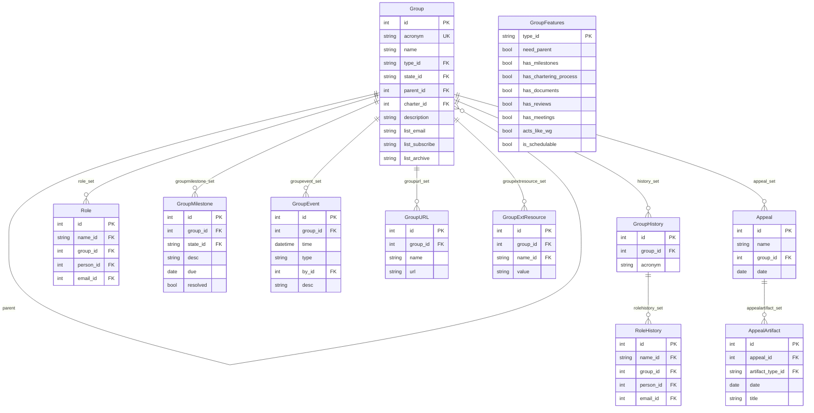

# Group

The `group` app models every kind of organisational entity in the IETF ecosystem.
Groups are identified by their **acronym**, which is the unique slug used in URLs and
cross-references throughout the datatracker.

## Group types

The `type` field of a `Group` is a FK to `GroupTypeName`. Current types include:

| slug | Name |
|------|------|
| `adhoc` | Ad Hoc |
| `adm` | Admin |
| `ag` | Area Group |
| `area` | Area |
| `dir` | Directorate |
| `review` | Directorate (with reviews) |
| `iab` | IAB |
| `iabasg` | IAB Administrative Support Group |
| `iana` | IANA |
| `iesg` | IESG |
| `ietf` | IETF |
| `individ` | Individual (special group for individual-submission documents) |
| `irtf` | IRTF |
| `ise` | ISE |
| `isoc` | ISOC |
| `nomcom` | NomCom |
| `program` | IAB Program |
| `rag` | Research Area Group |
| `rfcedtyp` | RFC Editor |
| `rg` | Research Group |
| `sdo` | SDO (ITU, ISO, 3GPP, etc. — used with liaison statements) |
| `team` | Team |
| `wg` | Working Group |

Groups have a `parent` self-referential FK. This is how Working Groups and directorates
are nested inside Areas, and Areas are nested inside the IETF group:

```python
from ietf.group.models import Group

# All active WGs in the ART area
Group.objects.filter(state='active', parent__acronym='art')
```

## GroupFeatures

Rather than a large set of boolean fields on `Group`, the capabilities of each group
*type* are expressed in a `GroupFeatures` record (one per `GroupTypeName`). This controls
things like:

- `need_parent` / `parent_types` — whether a parent group is required and which types are valid
- `has_milestones` — whether the group tracks milestones
- `has_chartering_process` — whether the group goes through a charter workflow
- `has_documents` — whether the group sponsors documents
- `has_reviews` — whether the group has a review queue
- `has_meetings` — whether the group appears on meeting agendas
- `acts_like_wg` — whether the group behaves like a Working Group for most purposes
- `create_wiki` — whether a wiki is auto-created
- `is_schedulable` — whether sessions can be requested for this group type
- `show_on_agenda` — whether the group appears on the meeting agenda filter
- `material_types` — JSON list of document types the group can produce as session materials
- `session_purposes` — JSON list of allowed session purposes
- Various role lists (`admin_roles`, `docman_roles`, `groupman_roles`, etc.)

## Model diagram



## States, events, and history

Groups have similar but simpler state, event, and history mechanics to documents:

- `GroupStateName` values: `bof`, `proposed`, `active`, `dormant`, `concluded`, `abandoned`
- `GroupEvent` subtypes: `ChangeStateGroupEvent`, `MilestoneGroupEvent` (multi-table inheritance)
- `GroupHistory` snapshots the group metadata; `RoleHistory` snapshots roles

Note that role history only extends back about a decade — it is not a complete record of
every person who has ever held a given role.

## Roles

`Role` records assign named positions within groups. The `name` FK points to `RoleName`;
common values include:

| slug | Name |
|------|------|
| `ad` | Area Director |
| `chair` | Chair |
| `secr` | Secretary |
| `techadv` | Tech Advisor |
| `editor` | Editor |
| `delegate` | Delegate |
| `liaison` | Liaison Member |
| `member` | Member |
| `reviewer` | Reviewer |
| `matman` | Materials Manager |
| `recman` | Recording Manager |
| `lead` | Lead |
| `auth` | Authorized Individual |
| `atlarge` | At Large Member |
| `robot` | Automation Robot |
| `execdir` | Executive Director |
| `admdir` | Administrative Director |
| `advisor` | Advisor |
| `liaiman` | Liaison Manager |
| `announce` | List Announcer |
| `liaison_contact` | Liaison Contact |
| `liaison_cc_contact` | Liaison CC Contact |
| `pre-ad` | Incoming Area Director |

```python
from ietf.group.models import Role, RoleHistory

# Current active roles for a person
Role.objects.filter(person__name='Somebody', group__state='active')

# Historical WG/RG chair roles for a person (not a complete record)
set(RoleHistory.objects.filter(
    person__name='Somebody',
    group__type__in=('wg', 'rg'),
    name='chair'
).values_list('group__acronym', flat=True))
```

## Milestones

`GroupMilestone` records track deliverables for a working group. Each milestone has a
`state` (active, deleted, for-review, chartering), a due date, and a M2M link to the
`Document` records that fulfil it. `GroupMilestoneHistory` records snapshots of milestones.

## Appeals

`Appeal` records document formal appeals of group decisions. Each appeal can have one or
more `AppealArtifact` records storing the supporting documents (in binary form with an
associated content type).
