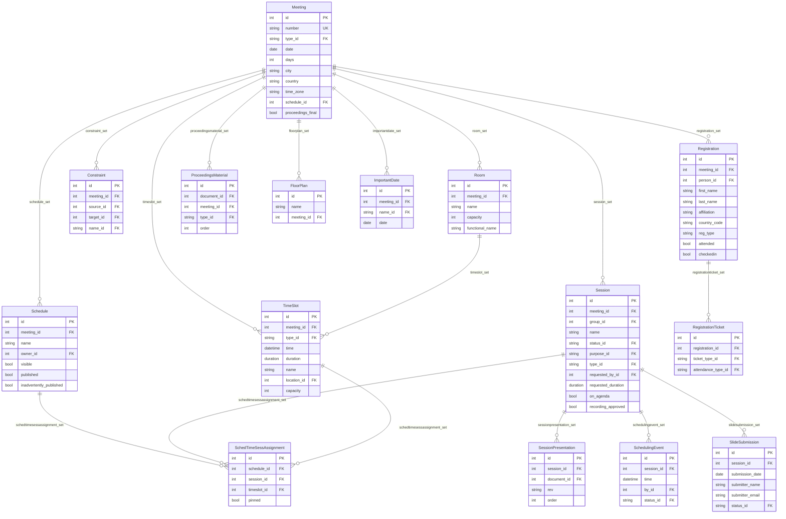

# Meeting

The meeting application is the most complex part of the datatracker. It covers IETF
plenary meetings, interim meetings, and the scheduling of sessions within them.

## Core concepts

The best way to understand the meeting data model is from the perspective of a **Session**.

A `Session` begins life as a session request associated with a `Meeting`. It is then
assigned to a `TimeSlot` (which is attached to a `Room`) within a `Schedule` for the
meeting. The secretariat can (and does) produce several candidate `Schedule` objects for
a single meeting, so a `Session` may have multiple `SchedTimeSessAssignment` records but
will have at most one assignment within any given `Schedule`. One `Schedule` is marked as
the official (`published`) schedule for the meeting and drives the public agenda pages.

Even virtual interims follow this model: such an interim has one `Meeting`, one official
`Schedule`, one `Session`, one `TimeSlot`, one `Room`, and one `SchedTimeSessAssignment`.

Meeting resources — agendas, slides, minutes, bluesheets, chat logs, recordings — are all
stored as `Document` records associated with the `Session` via `SessionPresentation`.

## Scheduling constraints

The secretariat uses a schedule-editing application to minimise conflicts between
sessions. Conflicts are stored as `Constraint` records (WG A must not overlap with WG B,
person X must be present at session Y, etc.) and as `BusinessConstraint` records for
policy-level constraints. A management command can algorithmically build a schedule that
minimises the total constraint cost.

## Model diagram



## Session status and lifecycle

Session status is tracked via `SchedulingEvent` records (the most recent one determines
the current status), not as a single mutable field. This provides a complete history of
status transitions. Common `SessionStatusName` values:

| slug | Description |
|------|-------------|
| `waiting-for-approval` | Requested, awaiting approval |
| `approved` | Approved but not yet scheduled |
| `waiting-for-scheduling` | Ready to place in the schedule |
| `scheduled` | Assigned to a timeslot |
| `cancelled` | Session cancelled |
| `disapproved` | Session request rejected |

## Session purposes

`SessionPurposeName` controls how a session appears in the agenda and which timeslot
types are allowed. Values include `regular`, `tutorial`, `office-hours`, `coding`,
`social`, `admin`. The `on_agenda` flag controls whether sessions with that purpose
appear in the public agenda.

## Session materials

Materials associated with a session are retrieved via the `materials` manager, which
returns `Document` objects. For example:

```python
from ietf.meeting.models import Session

materials = Session.objects.get(
    meeting__number='120', group__acronym='httpbis'
).materials.all()
# <QuerySet [<Document: agenda-120-httpbis>, <Document: minutes-120-httpbis>, ...]>
```

## Meeting registration

`Registration` records come from the Secretariat's registration system. Each `Registration`
can have one or more `RegistrationTicket` records indicating ticket type
(`week`, `one_day`, `student`) and attendance type (`onsite`, `remote`,
`hackathon_onsite`, `hackathon_remote`). The `attended` and `checkedin` flags are
updated during the meeting.

> **Historical note:** An older `stats.MeetingRegistration` table predates this model
> and still exists for legacy data. New registrations use `meeting.Registration`.

## Proceedings materials

`ProceedingsMaterial` links a `Document` to a `Meeting` for proceedings items that are
not attached to a specific session (e.g. host-organisation speaker series, supporter
acknowledgements, social event information). The `type` field is a FK to
`ProceedingsMaterialTypeName`.

## Important dates

`ImportantDate` records store named key dates for a meeting (registration-opens,
id-cutoff, etc.), derived from `ImportantDateName` which carries a `default_offset_days`
to help generate these dates for future meetings.
