# Meeting

The meeting application is the most complex part of the datatracker. It covers IETF
plenary meetings, interim meetings, and the scheduling of sessions within them.

## Core concepts

The best way to understand the meeting data model is from the perspective of a **Session**.

A `Session` begins life as a session request associated with a `Meeting`. It is then
assigned to a `TimeSlot` (which is attached to a `Room`) within a `Schedule` for the
meeting. The secretariat can (and does) produce several candidate `Schedule` objects for
a single meeting, so a `Session` may have multiple `SchedTimeSessAssignment` records but
will have at most one assignment within any given `Schedule`. One `Schedule` is marked as
the official schedule for the meeting (via `Meeting.schedule` FK) and drives the public
agenda pages.

Even virtual interims follow this model: such an interim has one `Meeting`, one official
`Schedule`, one `Session`, one `TimeSlot`, one `Room`, and one `SchedTimeSessAssignment`.

Meeting resources — agendas, slides, minutes, bluesheets, chat logs, recordings — are all
stored as `Document` records associated with the `Session` via `SessionPresentation`.

## Meeting

`Meeting.number` is a unique string. For IETF plenary meetings it is a decimal integer
string like `"120"`; `get_number()` returns this as an `int`. For interims, retreats, and
summits it is an arbitrary identifier string and `get_number()` returns `None`.

`Meeting.type` (FK to `MeetingTypeName`) is either `ietf` or `interim`.

Key fields:

| Field | Description |
|-------|-------------|
| `date` | First day of the meeting |
| `days` | Duration in days |
| `city` / `country` / `time_zone` | Location |
| `schedule` | FK → Schedule — the currently official agenda |
| `proceedings_final` | Whether proceedings have been finalised |
| `acknowledgements` | ReStructuredText for the proceedings acknowledgements page |
| `attendees` | Headcount for backfilled historical meetings; computed from `Registration` for newer ones |
| `group_conflict_types` | M2M → ConstraintName — which group-conflict constraint types are active for this meeting |
| `session_request_lock_message` | Non-empty string locks the session request form |

`Meeting` also carries several I-D submission cutoff fields
(`idsubmit_cutoff_day_offset_00`, `idsubmit_cutoff_day_offset_01`,
`idsubmit_cutoff_time_utc`, `idsubmit_cutoff_warning_days`) that control when new and
updated Internet-Drafts can be submitted relative to the meeting start date. The
`get_00_cutoff()` and `get_01_cutoff()` methods compute the actual cutoff datetimes,
preferring an explicit `ImportantDate` record over the offset formula.

## Schedule

Each `Schedule` belongs to a `Meeting` and is owned by a `Person`. Multiple schedules
can exist for the same meeting (e.g. draft schedules being reviewed by the IESG before
publication).

| Field | Description |
|-------|-------------|
| `name` | Short identifier (letters, numbers, `-:_`) |
| `owner` | FK → Person |
| `visible` | Show in the public list of agendas for this meeting |
| `public` | Allow anyone with the URL to view the schedule |
| `base` | FK → Schedule (self) — inherit all assignments from this schedule |
| `origin` | FK → Schedule (self) — the schedule this one was copied from |
| `badness` | Total constraint-violation penalty score from the schedule optimiser |

The `base` field is important: an official schedule may sit on top of a base schedule
that holds the plenary and other fixed sessions, with WG sessions layered on top.
`Session.official_timeslotassignment()` checks both `meeting.schedule` and
`meeting.schedule.base` when looking up where a session lands.

`is_official` is true when `meeting.schedule == self`. `is_official_record` adds
the further requirement that the meeting has ended.

## Session

A `Session` represents one group's request for meeting time. Key fields:

| Field | Description |
|-------|-------------|
| `meeting` | FK → Meeting |
| `group` | FK → Group — the sponsoring group |
| `name` | Free text, for sessions that aren't simply a group meeting (e.g. tutorial titles) |
| `short` | Abbreviated name for use in filenames |
| `type` | FK → TimeSlotTypeName — the *physical* slot kind (see below) |
| `purpose` | FK → SessionPurposeName — the *functional* purpose (see below) |
| `requested_duration` | Requested length as a `DurationField` |
| `joint_with_groups` | M2M → Group — other groups sharing this session |
| `on_agenda` | Whether this session appears on the public agenda |
| `has_onsite_tool` | Whether Meetecho/onsite tooling is in use for this session |
| `remote_instructions` | Free-text instructions for remote participants |
| `chat_room` | Zulip stream name; defaults to the group acronym if blank |
| `meetecho_recording_name` | Override for the Meetecho recording identifier |
| `tombstone_for` | FK → Session (self) — if set, this session is a tombstone for a rescheduled session |
| `materials` | M2M → Document (through `SessionPresentation`) |

### Session type vs purpose

`Session.type` (FK to `TimeSlotTypeName`) describes the physical slot category:
`regular`, `plenary`, `break`, `reg` (registration), `other`, etc.

`Session.purpose` (FK to `SessionPurposeName`) describes the functional intent:

| slug | Description | on\_agenda |
|------|-------------|-----------|
| `regular` | Normal WG/RG/team session | yes |
| `tutorial` | Tutorial or training | yes |
| `office-hours` | Office hours | yes |
| `coding` | Hackathon or coding sprint | yes |
| `social` | Social event | no |
| `admin` | Administrative (secretariat-only) | no |

The `on_agenda` flag on `SessionPurposeName` provides a default; `Session.on_agenda`
can override it for individual sessions.

### Joint sessions

`Session.joint_with_groups` is a M2M to `Group`. When set, the session appears in the
agendas of all the listed groups as well as the primary `group`. The group acronyms are
used to construct document names (e.g. slide filenames).

### Tombstone sessions

When a session is rescheduled, the original `Session` is replaced by a new one and a
tombstone record is created with `tombstone_for` pointing to the replacement. This
preserves links to old `SessionPresentation` and `SchedulingEvent` records.

## Session status and lifecycle

Session status is not stored as a single mutable field. Instead, `SchedulingEvent`
records are appended as the session moves through its lifecycle; the most recent record
determines the current status. This gives a complete audit trail of who changed the
status and when.

Because the current status is not a database column, filtering sessions by status
requires a subquery. Use the `with_current_status()` queryset annotation:

```python
from ietf.meeting.models import Session

# Sessions that are scheduled for a specific meeting
Session.objects.filter(meeting__number='120').with_current_status().filter(
    current_status='sched'
)
```

Full set of `SessionStatusName` slugs:

| slug | Description |
|------|-------------|
| `apprw` | Awaiting approval |
| `appr` | Approved, not yet scheduled |
| `schedw` | Waiting to be scheduled |
| `scheda` | Scheduled (by AD) |
| `sched` | Scheduled |
| `canceled` | Cancelled after being scheduled |
| `canceledpa` | Cancelled (pre-approval) |
| `disappr` | Disapproved |
| `notmeet` | Group will not meet at this meeting |
| `deleted` | Deleted |

`Session.CANCELED_STATUSES = ['canceled', 'canceledpa']` is the canonical list to use
when filtering out cancelled sessions.

## TimeSlot

`TimeSlot` records represent every named block that appears on the meeting agenda,
including breaks, registration periods, and reserved slots — not just schedulable
sessions.

`TimeSlot.time` is stored as a timezone-aware `DateTimeField` (Django's `USE_TZ=True`).
The raw value is UTC. Use `local_start_time()` and `local_end_time()` to convert to the
meeting's local timezone for display.

`TimeSlotTypeName` slugs include: `session`, `plenary`, `break`, `reg`, `other`,
`reserved`, `unavail`, `offagenda`. The last three are in
`TimeSlot.TYPES_NOT_SCHEDULABLE` and cannot have a `Session` assigned to them.

## Room and resources

`Room.name` is the official venue name. `Room.functional_name` is a shorter, more
descriptive label used in the agenda (e.g. `"Elks A/B"` rather than the hotel room
code). When both are set and differ, the functional name is shown to participants.

`Room.session_types` (M2M → `TimeSlotTypeName`) restricts which slot types may be
placed in the room. `Room.floorplan` (FK → `FloorPlan`) places the room on the building
floor plan image with pixel coordinates `(x1, y1, x2, y2)`.

`UrlResource` records attach URLs to rooms for audio streams, Meetecho video streams,
and onsite tool links. Each `UrlResource` has a `name` FK to `RoomResourceName` that
identifies the resource type (`audiostream`, `meetecho`, `meetecho_onsite`, `webex`).

## Constraint system

### Per-meeting constraints

`Constraint` records express scheduling preferences and requirements for a specific group
at a specific meeting:

| name slug | Meaning |
|-----------|---------|
| `conflict` | Source and target WGs must not overlap (chair conflict — highest priority) |
| `conflic2` | Source and target WGs should not overlap (technology overlap) |
| `conflic3` | Source and target WGs should not overlap (key person conflict) |
| `bethere` | A specific person (`Constraint.person`) must be present at the source session |
| `timerange` | Source group cannot meet during specified `timeranges` (M2M → `TimerangeName`) |
| `time_relation` | Source and target sessions must be on subsequent days or have one free day between them (`Constraint.time_relation`) |
| `wg_adjacent` | Source session must be placed directly before or after the target, in the same room |

The `ConstraintName.penalty` value controls how heavily violations are weighted by the
automated schedule optimiser. Whether group-conflict constraint types appear in the editor
is controlled by `Meeting.group_conflict_types`.

### Global constraints

`BusinessConstraint` records hold penalty weights for global scheduling rules that apply
across all sessions at all meetings (e.g. minimum time between back-to-back sessions).
These are distinct from per-meeting `Constraint` records and are consumed only by the
automated schedule generator.

## Model diagram

```mermaid
erDiagram
    Meeting {
        int id PK
        string number UK
        string type_id FK
        date date
        int days
        string city
        string country
        string time_zone
        int schedule_id FK
        bool proceedings_final
    }
    Schedule {
        int id PK
        int meeting_id FK
        string name
        int owner_id FK
        bool visible
        bool public
        int base_id FK
        int origin_id FK
        int badness
    }
    Session {
        int id PK
        int meeting_id FK
        int group_id FK
        string name
        string type_id FK
        string purpose_id FK
        duration requested_duration
        bool on_agenda
        bool has_onsite_tool
        int tombstone_for_id FK
    }
    TimeSlot {
        int id PK
        int meeting_id FK
        string type_id FK
        datetime time
        duration duration
        string name
        int location_id FK
    }
    Room {
        int id PK
        int meeting_id FK
        string name
        string functional_name
        int capacity
        int floorplan_id FK
    }
    UrlResource {
        int id PK
        string name_id FK
        int room_id FK
        string url
    }
    FloorPlan {
        int id PK
        int meeting_id FK
        string name
        string short
        int order
    }
    SchedTimeSessAssignment {
        int id PK
        int schedule_id FK
        int session_id FK
        int timeslot_id FK
        bool pinned
        int extendedfrom_id FK
        int badness
    }
    SessionPresentation {
        int id PK
        int session_id FK
        int document_id FK
        string rev
        int order
    }
    SchedulingEvent {
        int id PK
        int session_id FK
        datetime time
        int by_id FK
        string status_id FK
    }
    Constraint {
        int id PK
        int meeting_id FK
        int source_id FK
        int target_id FK
        int person_id FK
        string name_id FK
        string time_relation
    }
    BusinessConstraint {
        string slug PK
        string name
        int penalty
    }
    Registration {
        int id PK
        int meeting_id FK
        int person_id FK
        string first_name
        string last_name
        string affiliation
        string country_code
        bool checkedin
    }
    RegistrationTicket {
        int id PK
        int registration_id FK
        string ticket_type_id FK
        string attendance_type_id FK
    }
    Attended {
        int id PK
        int person_id FK
        int session_id FK
        datetime time
        string origin
    }
    ProceedingsMaterial {
        int id PK
        int meeting_id FK
        int document_id FK
        string type_id FK
    }
    MeetingHost {
        int id PK
        int meeting_id FK
        string name
    }
    ImportantDate {
        int id PK
        int meeting_id FK
        string name_id FK
        date date
    }
    SlideSubmission {
        int id PK
        int session_id FK
        string title
        string filename
        bool apply_to_all
        int submitter_id FK
        string status_id FK
        int doc_id FK
    }

    Meeting ||--o{ Session : "session_set"
    Meeting ||--o{ TimeSlot : "timeslot_set"
    Meeting ||--o{ Schedule : "schedule_set"
    Meeting ||--o{ Room : "room_set"
    Meeting ||--o{ Constraint : "constraint_set"
    Meeting ||--o{ Registration : "registration_set"
    Meeting ||--o{ ProceedingsMaterial : "proceedings_materials"
    Meeting ||--o{ FloorPlan : "floorplan_set"
    Meeting ||--o{ ImportantDate : "importantdate_set"
    Meeting ||--o{ MeetingHost : "meetinghosts"
    Schedule ||--o| Schedule : "base"
    Schedule ||--o{ SchedTimeSessAssignment : "assignments"
    Session ||--o{ SchedTimeSessAssignment : "timeslotassignments"
    TimeSlot ||--o{ SchedTimeSessAssignment : "sessionassignments"
    Room ||--o{ TimeSlot : "timeslot_set"
    Room ||--o{ UrlResource : "urlresource_set"
    Room }o--o| FloorPlan : "floorplan"
    Session ||--o{ SessionPresentation : "presentations"
    Session ||--o{ SchedulingEvent : "schedulingevent_set"
    Session ||--o{ SlideSubmission : "slidesubmission_set"
    Session ||--o| Session : "tombstone_for"
    Registration ||--o{ RegistrationTicket : "tickets"
    Session ||--o{ Attended : "attended_set"
```



## Session materials

Materials associated with a session are linked via `SessionPresentation` and exposed
through the `Session.materials` M2M manager. Convenience accessors exist for each type:
`session.agenda()`, `session.minutes()`, `session.slides()`, `session.bluesheets()`,
`session.recordings()`, `session.chatlogs()`.

```python
from ietf.meeting.models import Session

session = Session.objects.get(meeting__number='120', group__acronym='httpbis')
session.materials.all()
# <QuerySet [<Document: agenda-120-httpbis>, <Document: minutes-120-httpbis>, ...]>
session.slides()
# [<Document: slides-120-httpbis-...>, ...]
```

`SessionPresentation.order` controls display order. The underlying database table is
`meeting_session_materials` (a legacy name from before the model was renamed).

`SlideSubmission` records track slides that have been staged for review before being
accepted into the session materials. `apply_to_all` indicates the slides should apply
to all sessions of the group at this meeting, not just one.

## Attendance

`Attended` records individual session attendance at the per-session level, with a
`unique_together` constraint on `(person, session)`. The `origin` field notes how the
record was created (`datatracker`, bluesheet import, etc.).

`Registration.checkedin` indicates that the person collected their badge.
`Registration.attended` is a legacy field used by `Meeting.get_attendance()` for meetings
before the `Attended` model existed; do not use it for current meetings.
`Meeting.get_attendance()` returns a named tuple with `onsite` and `remote` counts,
combining both mechanisms as appropriate for the meeting number.

## Meeting registration

`Registration` records come from the Secretariat's registration system. Each `Registration`
can have one or more `RegistrationTicket` records indicating ticket type
(`week`, `one_day`, `student`) and attendance type (`onsite`, `remote`,
`hackathon_onsite`, `hackathon_remote`). The custom manager provides `Registration.objects.onsite()`
and `Registration.objects.remote()` shortcuts.

> **Note:** `stats.MeetingRegistration` is unused and will be removed. It has been
> replaced by this model.

## Proceedings materials

`ProceedingsMaterial` links a `Document` (of `type="procmaterials"`) to a `Meeting` for
items that are not attached to a specific session (e.g. host-organisation speaker series,
supporter acknowledgements, social event information). There is at most one
`ProceedingsMaterial` per `(meeting, type)` pair.

## Meeting hosts

`MeetingHost` records represent meeting sponsors. Each has a `name` and an uploaded
`logo` image stored in blob-shadowed file storage.

## Important dates

`ImportantDate` records store named key dates for a meeting. `ImportantDateName` carries
a `default_offset_days` relative to the meeting start date, used to pre-populate dates
for new meetings. Where an `ImportantDate` row exists it overrides the computed value;
methods like `get_00_cutoff()` check for an explicit record before falling back to the
offset calculation.
