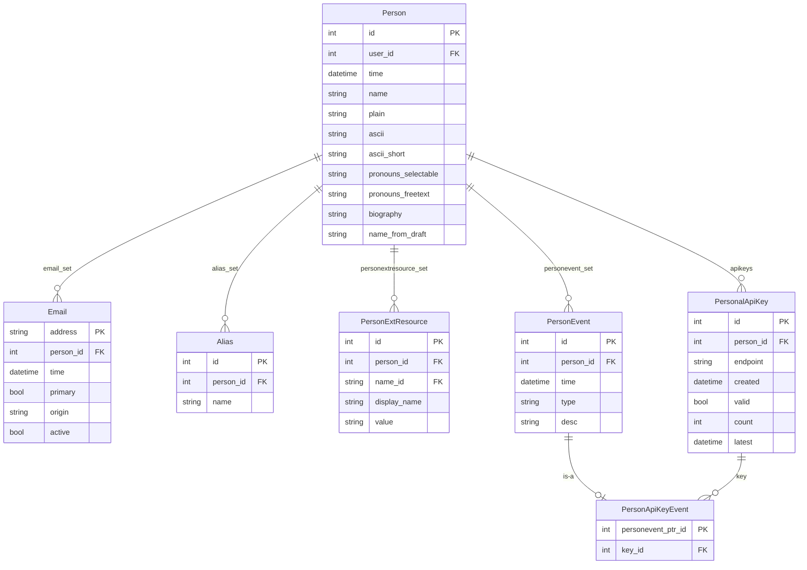

# Person

People are the central actors in the datatracker. Almost every other model eventually
traces back to a `Person`.

## Email addresses as identifiers

We primarily identify people using email addresses. The `Email` model associates a given
address with at most one `Person`. The `address` field is the primary key and is stored
as a case-insensitive character field (`CICharField`), so lookups are always
case-insensitive.

`Email.person` is **nullable** — an `Email` row can exist before it is linked to a
`Person`, and old addresses are **never deleted** because historical records (document
authorship, ballot positions, role history, etc.) reference people via their email
addresses. Once an address is deactivated it is kept in the database with `active=False`.

`Email.origin` records how the address entered the system. It takes one of three forms:

| Format | Meaning |
|--------|---------|
| `user@example.com` | Address provided directly by the user (same as the address itself) |
| `author: draft-foo-bar` | Address scraped from an I-D submission |
| `role: wg-name/chair` | Address inferred from a group role |

One address per person can be flagged `primary=True`. `Person.email()` returns the
primary address if one exists, otherwise the most recently seen active address.

By convention, enforced for several years now by the UI, login usernames look like email
addresses. The `User` record and the `Email` record are distinct objects. A `Person` has
at most one `User` (via `OneToOneField`), but may have many `Email` addresses.

## Names

We capture very little about a person — only names in various forms, optional pronouns,
a short biography, and a photo. The name fields:

| Field | Purpose |
|-------|---------|
| `name` | Preferred Unicode form, e.g. `김 철수` or `Dr. Bernard D. Aboba` |
| `ascii` | ASCII (Latin, unaccented) rendering, required when `name` contains non-ASCII |
| `ascii_short` | Abbreviated form, e.g. `B. Aboba`. Leave blank unless auto-generation produces wrong results |
| `plain` | Override for display. Intended for edge cases like Spanish double surnames where `name` would otherwise be parsed incorrectly — not for nicknames |
| `name_from_draft` | Name exactly as it appeared in the most recent I-D submission; not editable by the user |

Names are unstructured strings. Helper code in `ietf/person/name.py` attempts to parse
a name into `(prefix, first, middle, last, suffix)` parts heuristically, but the
assumption of Western name structure is explicit in the code and often wrong:

```python
from ietf.person.models import Person

Person.objects.get(name__contains='Aboba').name_parts()
# ('Dr.', 'Bernard', 'D.', 'Aboba', '')
#  prefix  first    middle  last   suffix
```

### Aliases

`Alias` records hold alternative name forms used in search. They are **automatically
maintained**: every time a `Person` is saved, the model's `save()` method ensures that
both `name` and `ascii` (when different) exist as `Alias` rows. You should not need to
create aliases manually for these two forms. Additional aliases (from old drafts, former
names, etc.) may be added by staff.

Because aliases are the primary name-search lookup point, a query like
`Person.objects.filter(alias__name__icontains='...')` is often more reliable than
filtering on `name` directly.

### Pronouns

Two fields store pronouns:
- `pronouns_selectable` — a JSON list of zero or more values chosen from a fixed set (e.g. `["he/him", "they/them"]`).
- `pronouns_freetext` — a free-text string up to 30 characters for anything not in the fixed set.

`Person.pronouns()` returns `pronouns_selectable` joined by commas when that list is
non-empty, falling back to `pronouns_freetext` otherwise. Display code should call
`pronouns()` rather than reading the fields directly.

## Affiliation and country

Affiliation and country are **not stored on Person**. They are captured at document
submission time and stored on `DocumentAuthor`, so the same person can have different
affiliations across different documents. `meeting.Registration` also captures affiliation as declared at meeting registration
time (`stats.MeetingRegistration` served the same purpose but is unused and will be
removed).

## Model diagram



## PersonalApiKey

API keys allow scripts and tools to authenticate against specific datatracker API
endpoints without using a password. Each key is scoped to a **single endpoint** — the
endpoint is baked into the HMAC-like hash and cannot be changed after creation. The hash
covers the key id, person id, creation timestamp, endpoint path, validity flag, a
per-key salt, and the Django `SECRET_KEY`.

Endpoints that accept API keys include IESG ballot submission, meeting session video URL
updates, bluesheet recording, attendee notification, and a few tool integrations.

## PersonEvent

`PersonEvent` provides a small audit trail for security-relevant changes to a person
record. Current `type` values:

| type | Meaning |
|------|---------|
| `apikey_login` | A request was authenticated using an API key |
| `email_address_deactivated` | An email address was marked inactive |

`PersonApiKeyEvent` is a subclass (Django multi-table inheritance) that adds a `key` FK
back to the `PersonalApiKey` that was used, making it possible to audit which key
triggered a login.

## PersonExtResource

`PersonExtResource` stores links to external services. The `name` FK points to
`ExtResourceName`, which carries a `type` FK to `ExtResourceTypeName` (values: `url`,
`email`, `string`). Common resources include GitHub usernames and repository URLs.

## Query examples

```python
from ietf.person.models import Person, Email, Alias

# Find by email address (case-insensitive)
Person.objects.get(email__address='someone@example.com')

# Search by any known name form (more reliable than filtering on name directly)
Person.objects.filter(alias__name__icontains='eggert').distinct()

# All active email addresses for a person
Email.objects.filter(person__name='Lars Eggert', active=True)

# People with a GitHub username registered
from ietf.person.models import PersonExtResource
PersonExtResource.objects.filter(
    name__slug='github-username'
).select_related('person').values_list('person__name', 'value')
```

Via the REST API:

```shell
curl "https://datatracker.ietf.org/api/v1/person/person/?name__startswith=Dr.%20&format=json" | jq
```
