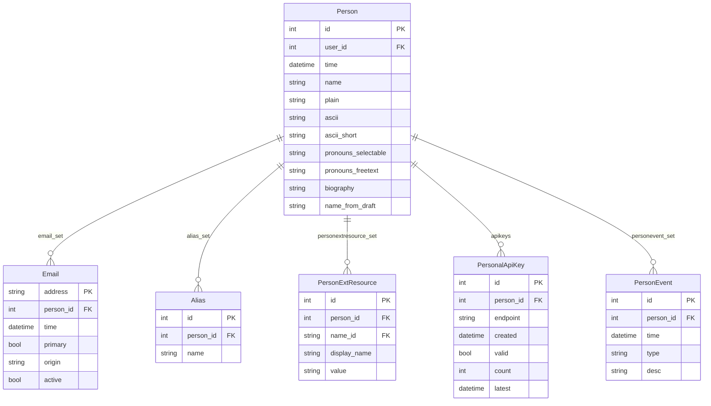

# Person

People are the central actors in the datatracker. Almost every other model eventually
traces back to a `Person`.

## Identification

We primarily identify people using email addresses. The `Email` model associates a given
address with at most one `Person`. Email addresses carry a few attributes:

- `active` — whether the address is currently in use
- `primary` — the preferred address for outbound mail
- `origin` — how the address entered the system (user-provided, scraped from a draft, etc.)

By convention, enforced for several years now by the UI, login usernames look like email
addresses, but the `User` record and the `Email` record are distinct. A `Person` has at
most one `User` (via `OneToOneField`), but may have many `Email` addresses.

## Names

We capture very little about a person: names in various forms, optional pronouns, a short
biography, and a photo. Names are stored as unstructured strings — people put surprising
things in them. Helper code in `ietf/person/name.py` attempts to heuristically parse a
name into `(prefix, first, middle, last, suffix)` parts, but this parsing is inherently
imperfect.

The `Person` model holds:

| Field | Purpose |
|-------|---------|
| `name` | Preferred Unicode form |
| `ascii` | ASCII (Latin, unaccented) rendering |
| `ascii_short` | Abbreviated form, e.g. `A. Nonymous` |
| `plain` | Override for edge cases such as Spanish double surnames |
| `pronouns_selectable` | JSON list of selected pronoun sets (e.g. `["he/him"]`) |
| `pronouns_freetext` | Free-text pronouns up to 30 characters |
| `name_from_draft` | Name as it appeared in the most recent I-D submission |
| `biography` | Short biography (plain text or reStructuredText) |

Affiliation and country captured at the time of document submission are stored on
`DocumentAuthor`, not on `Person` — the same person can have a different affiliation for
each document they author.

`Alias` rows hold alternative name forms for a person (e.g. the ASCII short name, or
names harvested from old drafts) and are used in search.

## Model diagram



## External resources

`PersonExtResource` stores links to external services for a person, such as a GitHub
username or repository URL. The `name` FK points to `ExtResourceName`, which in turn
has a `type` FK to `ExtResourceTypeName` (values: `url`, `email`, `string`).

## Querying examples

```python
from ietf.person.models import Person

# How many people have a "Dr." prefix?
Person.objects.filter(name__startswith='Dr. ').count()

# Parse the name parts for a person
Person.objects.get(name__contains='Aboba').name_parts()
# ('Dr.', 'Bernard', 'D.', 'Aboba', '')  — (prefix, first, middle, last, suffix)
```

Via the REST API:

```shell
curl "https://datatracker.ietf.org/api/v1/person/person/?name__startswith=Dr.%20&format=json" | jq
```
