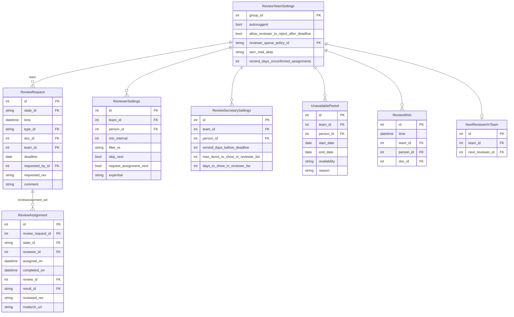

# Review

The `review` app manages document review teams, review requests, and review assignments.
Review teams are a special type of `Group` (`type="review"` or `type="dir"`) whose
`GroupFeatures.has_reviews` flag is true.

## Key models

### ReviewTeamSettings

`ReviewTeamSettings` holds configuration that is specific to a group's role as a review
team. It is a one-to-one extension of `Group`. Key fields:

| Field | Description |
|-------|-------------|
| `autosuggest` | Automatically suggest reviewers |
| `allow_reviewer_to_reject_after_deadline` | Whether reviewers may decline past deadline |
| `reviewer_queue_policy` | FK → ReviewerQueuePolicyName (RotateAlphabetically, LeastRecentlyUsed) |
| `review_types` | M2M → ReviewTypeName (early, lc, telechat) |
| `review_results` | M2M → ReviewResultName (ready, almost-ready, issues, nits, …) |
| `notify_ad_when` | M2M → ReviewResultName — notify the AD for these outcomes |
| `secr_mail_alias` | Email alias for the team secretary |
| `remind_days_unconfirmed_assignments` | Days before reminding about unconfirmed assignments |

### ReviewRequest

A `ReviewRequest` is created when a review of a document is needed by a specific team.
It records the document, team, deadline, type of review, and who requested it.

`ReviewRequestStateName` values:
- `requested` — created, awaiting assignment
- `assigned` — at least one reviewer assigned
- `withdrawn` — withdrawn before completion
- `overtaken` — superseded by a new revision
- `no-review-version` / `no-review-doc` — no review needed

### ReviewAssignment

A `ReviewAssignment` links a specific reviewer (an `Email`) to a `ReviewRequest`. A
single request can have multiple assignments (e.g. if a reviewer is replaced). The
completed review itself is stored as a `Document` record with `type="review"`, linked
via `ReviewAssignment.review` (a OneToOneField).

`ReviewAssignmentStateName` values:
- `accepted` / `rejected` — reviewer accepted or declined
- `withdrawn` — reviewer withdrew after accepting
- `overtaken` — superseded
- `no-response` — reviewer did not respond
- `part-completed` / `completed` — review submitted

### ReviewerSettings

`ReviewerSettings` stores per-reviewer preferences within a team:
- `min_interval` — minimum days between reviews
- `filter_re` — regex to filter out documents the reviewer does not want to review
- `skip_next` — skip the reviewer in the next rotation
- `request_assignment_next` — prefer this reviewer for the next assignment
- `expertise` — free-text description of reviewer's area of expertise

### UnavailablePeriod

Records time ranges when a reviewer is not available. The `availability` field
distinguishes `unavailable` (no reviews at all) from `canfinish` (can finish assigned
reviews but should not receive new ones).

### NextReviewerInTeam

Tracks the position in the reviewer rotation for teams using an alphabetical or
least-recently-used policy. Only one record per team.

## Model diagram

## Review results

`ReviewResultName` values (with common interpretations):

| slug | Meaning |
|------|---------|
| `ready` | Ready for publication as-is |
| `ready-issues` | Ready but has minor issues to address |
| `ready-nits` | Ready but has nits (editorial) |
| `almost-ready` | Minor issues should be addressed first |
| `right-track` | Heading in the right direction, but more work needed |
| `not-ready` | Not ready for publication |
| `issues` | Has significant issues |
| `nits` | Has only editorial issues |
| `serious-issues` | Has serious technical problems |

## Audit trail

`ReviewRequest` and `ReviewAssignment` both use `simple_history.HistoricalRecords`.
Changes to review state are also captured in `DocEvent` records (`ReviewRequestDocEvent`,
`ReviewAssignmentDocEvent`) on the document being reviewed.
