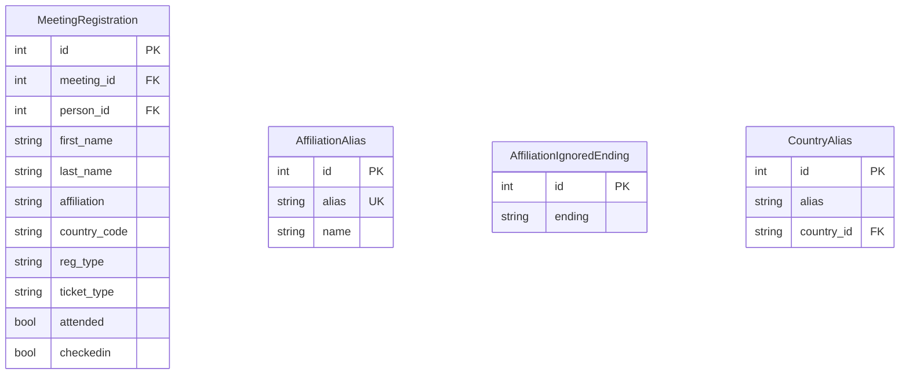
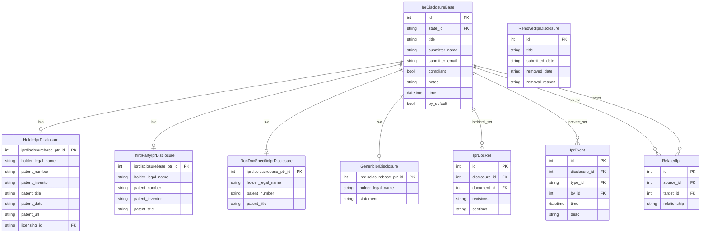
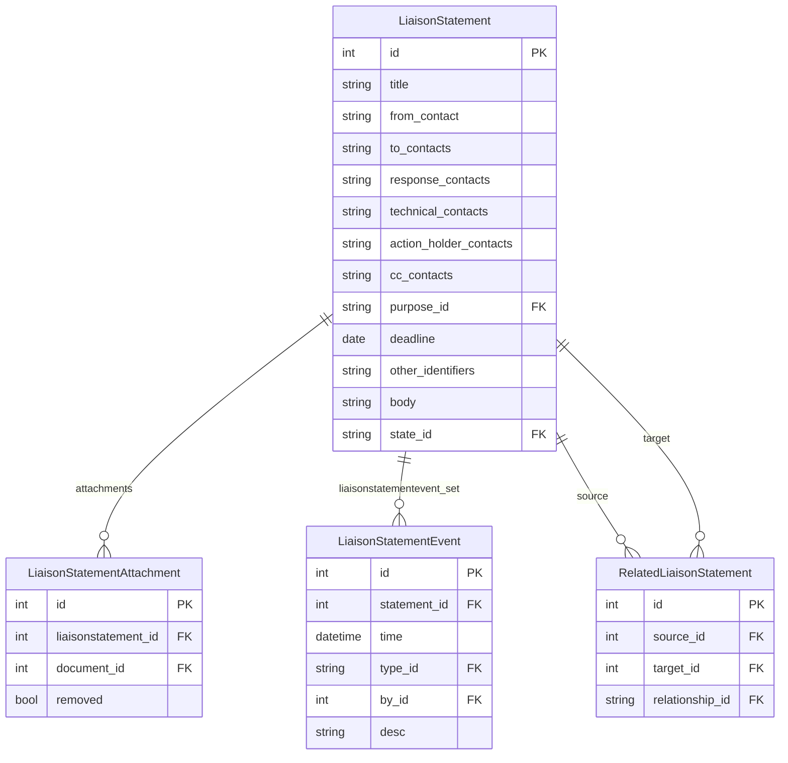
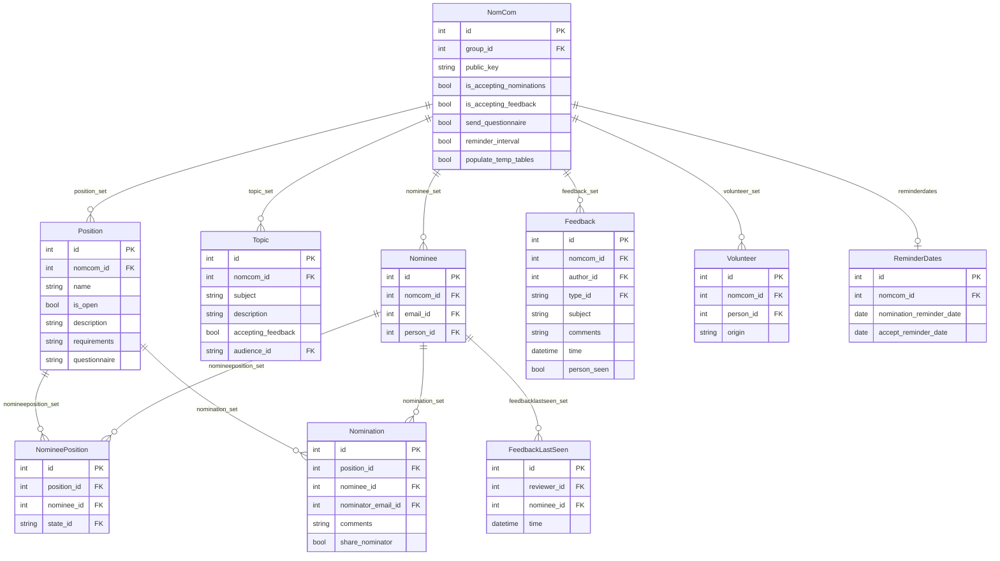

# Supporting Applications

## Stats

The `stats` app is an older, lightly-used analytics layer over the datatracker data.
It provides statistics similar to the analyses historically compiled by individual
contributors. It has known limitations and receives relatively little active development.

The app contains four models:

| Model | Purpose |
|-------|---------|
| `MeetingRegistration` | Legacy registration data imported from the Secretariat's system |
| `AffiliationAlias` | Canonical form for organisation name variants |
| `AffiliationIgnoredEnding` | Regex patterns for corporate suffixes to strip (LLC, Inc., …) |
| `CountryAlias` | Maps country name variants to `CountryName` |



`MeetingRegistration` provides affiliation, country code, and name variations for a person
as recorded at meeting registration time — details that are not on the `Person` record
itself. The `AffiliationAlias` and `AffiliationIgnoredEnding` tables are attempts to
normalise affiliation strings; they are sparsely populated:

```python
from ietf.stats.models import AffiliationAlias, AffiliationIgnoredEnding

AffiliationAlias.objects.all()
# [<AffiliationAlias: cisco -> Cisco Systems>, ...]

AffiliationIgnoredEnding.objects.all()
# [<AffiliationIgnoredEnding: LLC\.?>, <AffiliationIgnoredEnding: Ltd\.?>, ...]
```

> **Note:** `stats.MeetingRegistration` is a legacy table for data imported before the
> `meeting.Registration` model existed. New registrations are stored in
> `meeting.Registration` (see [meeting.md](meeting.md)).

---

## IPR

The `ipr` app tracks Intellectual Property Rights disclosures submitted to the IETF.

`IprDisclosureBase` is the abstract base (implemented with multi-table inheritance). The
four concrete subtypes are:

| Subclass | Use case |
|----------|---------|
| `HolderIprDisclosure` | Patent holder disclosing their own patent |
| `ThirdPartyIprDisclosure` | Third-party disclosure of someone else's patent |
| `NonDocSpecificIprDisclosure` | Patent disclosure not tied to a specific document |
| `GenericIprDisclosure` | General IPR statement without patent specifics |



`IprDocRel` links a disclosure to the `Document` records it covers, with optional
revision and section ranges. `IprEvent` provides the audit trail for each disclosure,
recording state changes, inbound and outbound messages, comments, and legacy migration
events. `RemovedIprDisclosure` stores a minimal record for disclosures that were removed.

---

## Liaisons

The `liaisons` app manages formal liaison statements exchanged between the IETF and
external standards organisations (ITU, ISO, 3GPP, etc.). The sending and receiving
organisations are `Group` records with `type="sdo"` or similar.



`LiaisonStatement` has M2M fields for `from_groups` and `to_groups` (both FK to
`Group`), and a M2M `tags` field (FK to `LiaisonStatementTagName`, values:
`action-required`, `action-taken`). Attached documents go through
`LiaisonStatementAttachment`, a through model that also tracks whether the attachment
has been removed.

`LiaisonStatementPurposeName` values: `for-action`, `for-comment`, `for-info`,
`in-response`, `other`.

---

## Nomcom

The `nomcom` app supports the IETF Nominations Committee process. Each year's NomCom is
represented by a `NomCom` record, which is associated with a `Group` record of
`type="nomcom"`.



`Feedback` content (nominations, questionnaire responses, and comments) is encrypted
with the NomCom's GPG public key stored in `NomCom.public_key`. This means feedback
text stored in the database is ciphertext and can only be decrypted by NomCom members
who hold the corresponding private key.

`NomineePositionStateName` values: `accepted`, `declined`, `none`.

`FeedbackTypeName` values: `questionnaires`, `nominations`, `comments`. Each type has a
`legend` field used in the UI.

`Volunteer` records track people who have volunteered to serve on the NomCom (as
distinguished from being nominated for a position). The `origin` field records how the
volunteer record was created.
