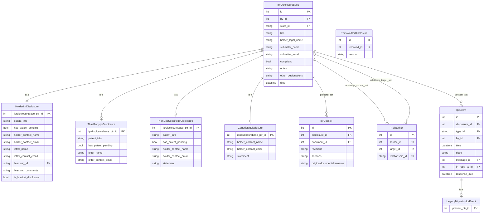
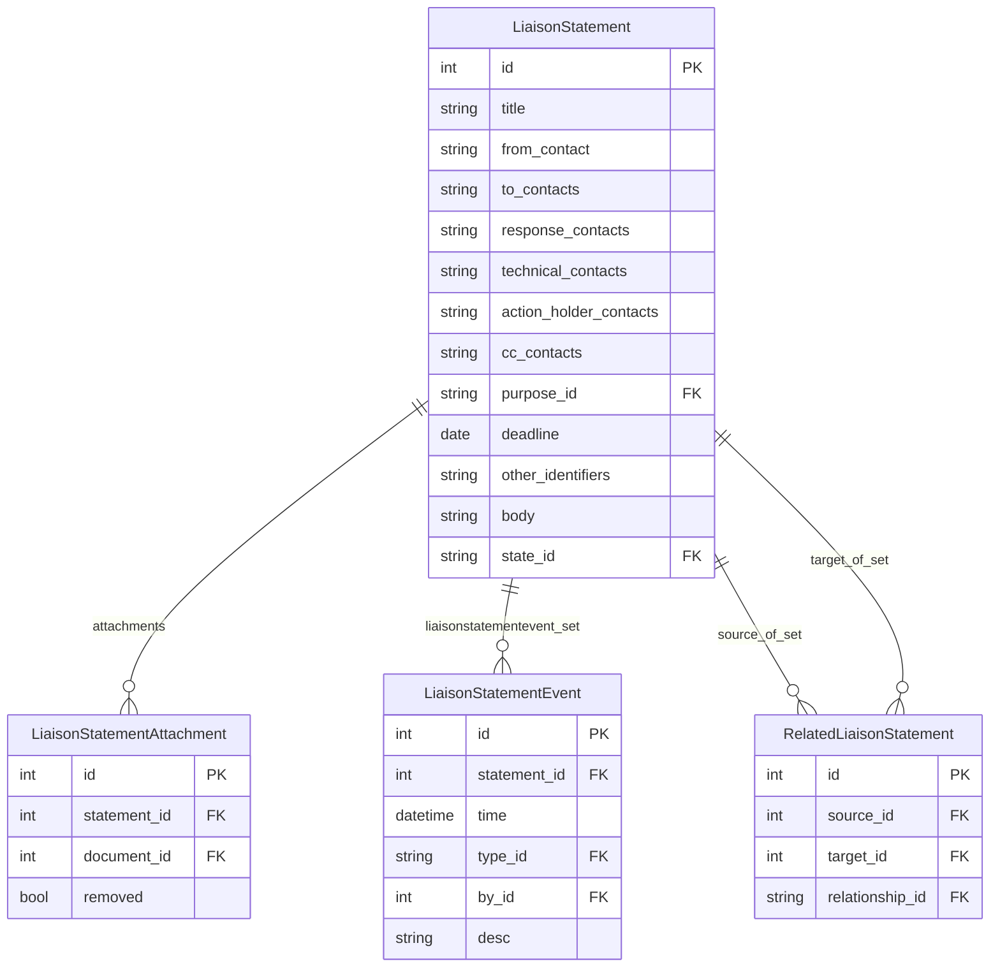
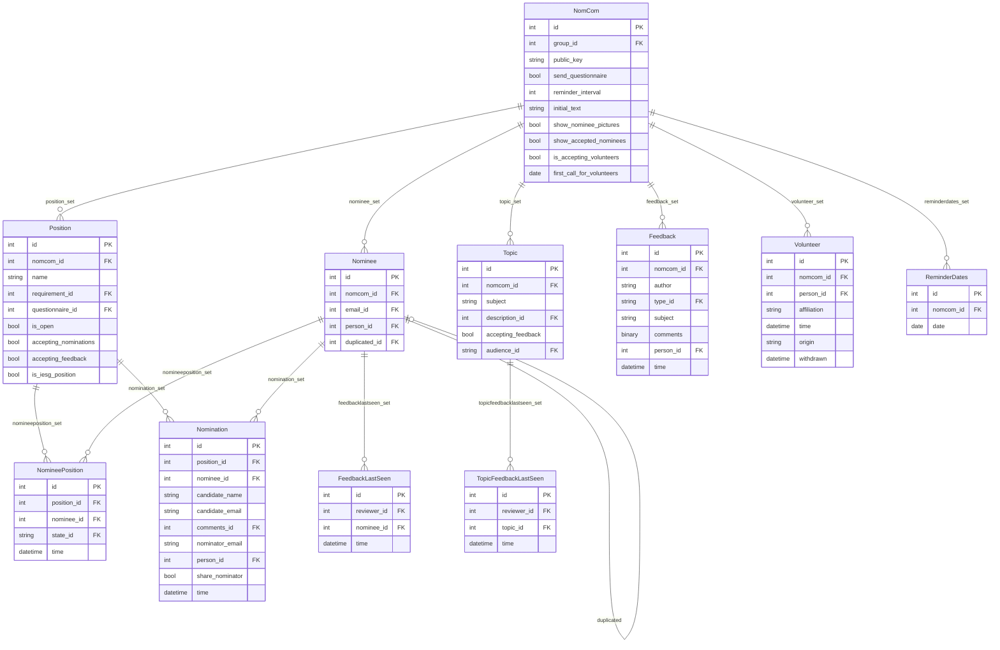

# Supporting Applications

## Stats

The `stats` app is an older, lightly-used analytics layer over the datatracker data.
As work allows, the parts that are still useful are being moved to other applications
and the remainder is being removed.

The app currently contains three active models and one that is being removed:

| Model | Purpose |
|-------|---------|
| `MeetingRegistration` | **Unused — will be removed.** Replaced by `meeting.Registration` |
| `AffiliationAlias` | Maps organisation name variants to a canonical form |
| `AffiliationIgnoredEnding` | Regex patterns for corporate suffixes to strip when normalising (LLC, Ltd, Inc, GmbH, …) |
| `CountryAlias` | Maps country name variants to `CountryName` |

`AffiliationAlias` and `AffiliationIgnoredEnding` are used together to normalise
affiliation strings before comparison. They are sparsely populated:

```python
from ietf.stats.models import AffiliationAlias, AffiliationIgnoredEnding

AffiliationAlias.objects.all()
# [<AffiliationAlias: cisco -> Cisco Systems>, ...]

AffiliationIgnoredEnding.objects.all()
# [<AffiliationIgnoredEnding: LLC\.?>, <AffiliationIgnoredEnding: Ltd\.?>, ...]
```

`CountryAlias` maps free-text country strings (as entered by submitters) to the
canonical `CountryName` (ISO 3166) used elsewhere. Like the affiliation tables it is
sparsely populated.

> **Note:** `stats.MeetingRegistration` is unused and will be removed. It has been
> replaced by `meeting.Registration` (see [meeting.md](meeting.md)).

---

## IPR

The `ipr` app tracks Intellectual Property Rights disclosures submitted to the IETF
under the rules of [BCP 79 / RFC 8179](https://www.rfc-editor.org/rfc/rfc8179).

### Disclosure types

`IprDisclosureBase` is the concrete base model; the four subtypes use Django
multi-table inheritance to add type-specific fields.

| Subclass | Use case |
|----------|---------|
| `HolderIprDisclosure` | Patent holder disclosing their own patent |
| `ThirdPartyIprDisclosure` | Third-party disclosure of someone else's patent |
| `NonDocSpecificIprDisclosure` | Patent disclosure not tied to a specific document |
| `GenericIprDisclosure` | General IPR statement without specific patent details |

Common fields on `IprDisclosureBase`:

| Field | Description |
|-------|-------------|
| `by` | FK → Person — who was logged in when the disclosure was submitted (`System` if submitted unauthenticated) |
| `state` | FK → IprDisclosureStateName |
| `title` | Title of the disclosure |
| `holder_legal_name` | Legal name of the patent holder |
| `submitter_name` / `submitter_email` | Contact details of the person who submitted |
| `compliant` | Whether the disclosure claims compliance with RFC 3979 |
| `notes` | Additional free-text notes |
| `other_designations` | Identifiers for contributions not covered by the linked documents |
| `docs` | M2M → Document (through `IprDocRel`) |
| `rel` | M2M to self (through `RelatedIpr`, asymmetric) |

`HolderIprDisclosure` adds patent details (`patent_info` text field), holder and IETF
contact fields (`holder_contact_name`, `holder_contact_email`, `holder_contact_info`,
`ietfer_name`, `ietfer_contact_email`, `ietfer_contact_info`), licensing terms
(`licensing` FK → `IprLicenseTypeName`, `licensing_comments`), and flags
(`has_patent_pending`, `submitter_claims_all_terms_disclosed`, `is_blanket_disclosure`).

`ThirdPartyIprDisclosure` adds similar IETF-contact and patent fields but no holder
contact, since the discloser is a third party.

`NonDocSpecificIprDisclosure` adds holder contact and patent fields plus a free-text
`statement` that includes licensing information.

`GenericIprDisclosure` has holder contact fields and a free-text `statement`; no
patent-specific fields.

`IprDisclosureStateName` values: `pending`, `parked`, `posted`, `rejected`, `removed`.

### Document links

`IprDocRel` links a disclosure to the `Document` records it covers:

| Field | Description |
|-------|-------------|
| `disclosure` | FK → IprDisclosureBase |
| `document` | FK → Document |
| `revisions` | String describing covered revisions, e.g. `"01-07"` |
| `sections` | Free-text section references |
| `originaldocumentaliasname` | Preserved original alias name (legacy field) |

### Disclosure relationships

`RelatedIpr` records directed relationships between disclosures via a `relationship` FK
to `DocRelationshipName` (reusing the doc relationship name table). The primary
relationship in practice is `updates`. `IprDisclosureBase` exposes `updates` and
`updated_by` properties as shortcuts, and `recursively_updates()` traverses the full
update chain.

### Events

`IprEvent` is the audit trail for each disclosure. Key fields beyond the standard
`time`, `by` (FK → Person), `disclosure` (FK → IprDisclosureBase), and `desc`:

| Field | Description |
|-------|-------------|
| `type` | FK → IprEventTypeName |
| `message` | FK → Message — inbound or outbound email message (nullable) |
| `in_reply_to` | FK → Message — the message this is a reply to (nullable) |
| `response_due` | Datetime by which a response is expected (nullable) |

`IprEventTypeName` values: `submitted`, `posted`, `parked`, `removed`, `rejected`,
`msgin`, `msgout`, `comment`, `legacy`, `update_notify`, `change_disclosure`.

When an `IprEvent` of type `posted`, `removed`, or `removed_objfalse` is saved, the
model automatically creates corresponding `DocEvent` records (`posted_related_ipr`,
`removed_related_ipr`, `removed_objfalse_related_ipr`) on each affected document.

`LegacyMigrationIprEvent` is a subclass of `IprEvent` (multi-table inheritance) used
specifically to preserve the body text of disclosures that were originally submitted by
email and imported from a legacy system.

### Removed disclosures

`RemovedIprDisclosure` stores a minimal tombstone for disclosures that have been
removed. Fields: `removed_id` (the original pk, unique) and `reason` (free text).

### Model diagram



---

## Liaisons

The `liaisons` app manages formal liaison statements exchanged between the IETF and
external standards organisations (ITU, ISO, 3GPP, etc.).

### LiaisonStatement

Sending and receiving organisations are `Group` records (typically `type="sdo"` for
external bodies). The statement body and contact addresses are free-text fields; the
groups involved are M2M relations.

| Field | Description |
|-------|-------------|
| `title` | Statement title |
| `from_groups` | M2M → Group — sending organisation(s) |
| `from_contact` | Email address of the formal sender (validated as a mailbox address) |
| `to_groups` | M2M → Group — receiving organisation(s) |
| `to_contacts` | Free-text email addresses at the recipient group |
| `response_contacts` | Where to send a response (RFC 4053) |
| `technical_contacts` | Who to contact for clarification (RFC 4053) |
| `action_holder_contacts` | Who is responsible for completing any required action |
| `cc_contacts` | Additional CC addresses |
| `purpose` | FK → LiaisonStatementPurposeName |
| `deadline` | Date by which any action is required (nullable) |
| `other_identifiers` | Reference numbers used by other bodies |
| `body` | Statement body text |
| `tags` | M2M → LiaisonStatementTagName |
| `attachments` | M2M → Document (through `LiaisonStatementAttachment`) |
| `state` | FK → LiaisonStatementState (default: `pending`) |

`LiaisonStatementPurposeName` values: `for-action`, `for-comment`, `for-info`,
`in-response`, `other`.

`LiaisonStatementTagName` values include `awaiting` (action required) and `taken`
(action completed).

### State lifecycle

`LiaisonStatementState` values: `pending`, `approved`, `dead`, `posted`.

State transitions and the event types they generate:

| From → To | Event type |
|-----------|-----------|
| `pending` → `pending` | `submitted` |
| `pending` → `approved` | `approved` |
| `pending` → `dead` | `killed` |
| `pending` → `posted` | `posted` |
| `approved` → `posted` | `posted` |
| `dead` → `pending` | `resurrected` |

`LiaisonStatement.approved` is a property that returns `True` when the state is
`approved` or `posted`. `is_outgoing()` returns `True` when the first `to_group`
has `type="sdo"`, indicating the IETF is the sender.

Key date properties derived from events: `submitted` (time of the `submitted` event),
`posted` (time of the `posted` event), `modified` (time of the most recent event),
`sort_date` (posted date for posted statements, submitted date otherwise).

### Attachments

`LiaisonStatementAttachment` is the through model for the `attachments` M2M. The
`removed` flag soft-deletes an attachment without breaking the M2M link.
`active_attachments()` returns the attachment documents excluding removed ones.

### Related statements

`RelatedLiaisonStatement` captures directed relationships between two
`LiaisonStatement` records. The `relationship` FK reuses `DocRelationshipName`.

### Events

`LiaisonStatementEvent` is the audit trail. `LiaisonStatementEventTypeName` values:
`submitted`, `modified`, `approved`, `posted`, `killed`, `resurrected`, `msgin`,
`msgout`, `comment`.

### Model diagram



---

## Nomcom

The `nomcom` app supports the IETF Nominations Committee process. Each year's NomCom is
represented by a `NomCom` record, which is linked to a `Group` record of
`type="nomcom"`. The group acronym is `nomcomYYYY` (e.g. `nomcom2024`); `NomCom.year()`
parses the year from this.

### NomCom

Key fields:

| Field | Description |
|-------|-------------|
| `group` | FK → Group |
| `public_key` | FileField — the S/MIME public key certificate used to encrypt feedback |
| `send_questionnaire` | Automatically send questionnaires after nominations |
| `reminder_interval` | Days between automatic reminders to nominees who have not responded (nullable) |
| `initial_text` | Help text shown on the nomination form |
| `show_nominee_pictures` | Display nominee photos on feedback pages |
| `show_accepted_nominees` | Show accepted nominees on the public nomination page |
| `is_accepting_volunteers` | Whether the volunteer form is currently open |
| `first_call_for_volunteers` | Date of the first call for volunteers (nullable) |

When a `NomCom` is created, `initialize_templates_for_group()` automatically creates a
set of `DBTemplate` records under the group path for email templates, nomination form
text, and questionnaires.

`NomCom.encrypt(cleartext)` uses `openssl smime` with the stored certificate to encrypt
a string. The result is stored in `Feedback.comments` as binary ciphertext.

### Position

A `Position` represents a role being filled by this NomCom (e.g. "Transport AD", "IAB
Member"). Key fields:

| Field | Description |
|-------|-------------|
| `nomcom` | FK → NomCom |
| `name` | Short description shown on nomination and feedback pages |
| `requirement` | FK → DBTemplate — position-specific requirements text |
| `questionnaire` | FK → DBTemplate — questionnaire template |
| `is_open` | Whether the NomCom is actively working on this position |
| `accepting_nominations` | Whether nominations are currently open |
| `accepting_feedback` | Whether feedback is currently open |
| `is_iesg_position` | Whether to include generic IESG requirements alongside position-specific ones |

### Nominee and NomineePosition

`Nominee` identifies a candidate by their `Email` address within a specific `NomCom`
(unique together). `Nominee.person` is nullable for cases where the email cannot be
resolved to a `Person`. `Nominee.duplicated` is a self-FK used to merge duplicate
nominee records.

`NomineePosition` is the through model linking nominees to positions, with a `state`
FK to `NomineePositionStateName`. New records default to the `pending` state.

`NomineePositionStateName` values: `pending`, `accepted`, `declined`.

### Nomination

`Nomination` records a specific nomination of a `Nominee` for a `Position`. Key fields:

| Field | Description |
|-------|-------------|
| `position` | FK → Position |
| `nominee` | FK → Nominee |
| `candidate_name` / `candidate_email` / `candidate_phone` | Details as entered by the nominator |
| `comments` | FK → Feedback — the nominator's comments, stored encrypted |
| `nominator_email` | Email address of the nominator |
| `person` | FK → Person — nominator resolved to a Person (nullable) |
| `share_nominator` | Whether the nominator consented to being identified to the nominee |

### Topic

`Topic` is a discussion subject (not a specific position) on which NomCom solicits
community feedback. `Topic.description` is a FK to a `DBTemplate` (auto-created on
save). `Topic.audience` (FK → `TopicAudienceName`) controls who can provide feedback;
values: `general`, `nominee`, `nomcom-member`.

### Feedback

`Feedback` stores community input on nominees and topics. The `comments` field is a
`BinaryField` containing the ciphertext produced by `NomCom.encrypt()`. It can only be
read by NomCom members who hold the corresponding private key.

| Field | Description |
|-------|-------------|
| `nomcom` | FK → NomCom |
| `author` | EmailField — the author's address (not a FK to Person, to preserve anonymity) |
| `type` | FK → FeedbackTypeName (nullable — unclassified until reviewed) |
| `positions` | M2M → Position |
| `nominees` | M2M → Nominee |
| `topics` | M2M → Topic |
| `subject` | Subject line |
| `comments` | BinaryField — encrypted ciphertext |
| `person` | FK → Person — resolved author (nullable, editable=False) |

`FeedbackTypeName` values: `questionnaires`, `nominations`, `comments`. Each has a
`legend` field used in the UI. Unclassified feedback (`type=None`) is visible in the
NomCom chair's pending queue; `NomCom.pending_email_count()` returns its size.

### FeedbackLastSeen and TopicFeedbackLastSeen

These track when a NomCom reviewer last viewed feedback for a particular nominee or
topic. `time` uses `auto_now=True` so it is automatically updated on every save.

### Volunteer

`Volunteer` records people who have expressed interest in serving on the NomCom
(distinct from being nominated for a leadership position). Key fields: `person` FK,
`nomcom` FK, `affiliation`, `time` (auto-set), `withdrawn` (datetime, nullable),
`origin` (how the record was created — e.g. `"datatracker"`).

### ReminderDates

`ReminderDates` stores individual reminder dates for a NomCom. Each row has a single
`date` field; multiple rows can exist per NomCom (one per reminder date needed).

### Model diagram


